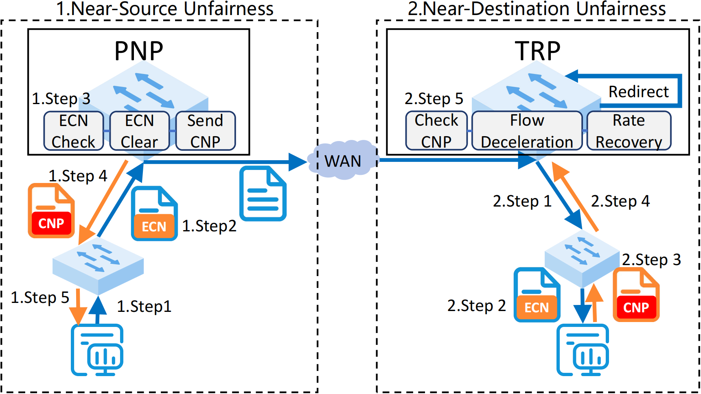

# THEMIS: Addressing Congestion-Induced Unfairness in Long-Haul RDMA Networks



THEMIS is a fairness maintenance patch designed to address congestion-induced unfairness in long-haul RDMA networks.

## Key Features

### Proactive Notification Point (PNP): 

Reduces feedback delay for near-source bottlenecks by generating congestion notifications (CNPs) within a single DC.

### Temporary Reaction Point (TRP): 

Temporarily throttles inter-DC flows to address near-destination bottlenecks until the sender receives congestion feedback.

### Compatibility: 

THEMIS is designed to be compatible with existing congestion control algorithms like DCQCN.

### Minimal Modifications: 

THEMIS requires only modifications at the external switches (ESW) connecting the DC to the WAN, ensuring minimal impact on existing infrastructure.

### Resource Efficiency: 

Optimized to minimize resource overhead on switches, making it deployable on current hardware.

## NS3 Simulation
The NS-3 module is developed based on the [HPCC](https://github.com/alibaba-edu/High-Precision-Congestion-Control) project.


### Setup
The project configuration method is consistent with [HPCC](https://github.com/alibaba-edu/High-Precision-Congestion-Control).
### Quickstart
```
cd simulation
./waf --run 'scratch/third mix/mix_70%_0.03s/config.txt' > mix/mix_70%_0.03s/out.txt 
cd mix/mix_70%_0.03s
python3 annalyze.py
```

The figures used in the paper were generated through `NS3/analysis`.
## P4 Testbed
Themis's main concern is whether the daemon packet sent via eBPF can be received by the switch CPU in time and successfully install the flow rule before the first RDMA data packet arrives. Therefore, we build a testbed to verify its validity. The topology is described below:

```
Host A --- Switch --- Host B
```

### Quickstart
**Start the switch:**

```
cd P4
$SDE_INSTALL/bin/bf_kdrv_mod_load $SDE_INSTALL
ls /dev/bf0
make switch
./control
```

**Start the eBPF daemon:**

```
cd eBPF
sudo python daemon.py
```

**Start RDMA RC Transfer:**

```
cd RDMA_RC_example
gcc -Wall -O2 -o RDMA_RC_example RDMA_RC_example.c -libverbs
// At the terminal of host B
./RDMA_RC_example -g 3 -d mlx5_0
// At the terminal of host A
./RDMA_RC_example -g 3 -d mlx5_0 <IP of HOST B>
```
